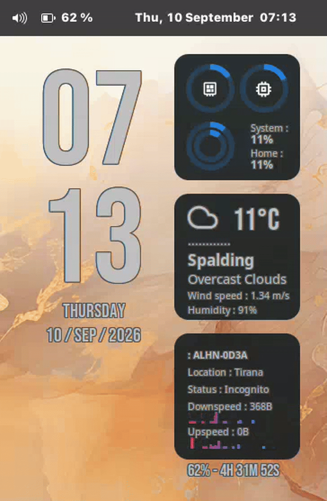

# conky-crt-glitch

A drop-in Lua overlay for [Conky](https://github.com/brndnmtthws/conky) that
adds an occasional "signal disruption" glitch on top of your theme: slice
tearing, RGB channel split, static bursts, dropout blocks and brief dark dips
— firing at random intervals, without touching or breaking your existing
widgets.

Works on top of **any** Cairo-capable Conky theme. It doesn't read your
theme's config or other Lua scripts — it just grabs a snapshot of whatever
Conky already drew and corrupts it.



## Before you start

You already need a working Conky theme running on your system. This project
doesn't create a theme for you — it bolts an effect onto one you already
have installed and running. If you don't have Conky set up yet, get a theme
working first, then come back here.

You also need Conky built with **Lua and Cairo support**. Almost every
Conky package from a normal Linux repo (`apt`, `dnf`, `pacman`, etc.)
already includes this — you don't need to do anything special. If you're
unsure, run:
```bash
conky -v
```
and check that `Lua` appears in the output.

## Quick start (step by step)

This walks through the whole thing using a made-up theme called `MyTheme`
as the example — swap in your own theme's actual name and location.

**1. Find your theme's folder and config file.**

Conky themes usually live under `~/.config/conky/`. For example:
```
~/.config/conky/MyTheme/MyTheme.conf
```
If you're not sure where yours is, this will search for you:
```bash
find ~/.config/conky -name "*.conf"
```

**2. Download `glitch.lua` and put it next to your theme's other scripts.**

Most themes keep their Lua/shell helper files in a `scripts` subfolder.
Put `glitch.lua` there too, e.g.:
```
~/.config/conky/MyTheme/scripts/glitch.lua
```
(If your theme has no `scripts` folder, just create one, or drop the file
directly into the theme folder — the exact location doesn't matter as long
as you point to it correctly in step 4.)

**3. Open your theme's `.conf` file in a text editor.**

```bash
gedit ~/.config/conky/MyTheme/MyTheme.conf
```
(Swap `gedit` for whatever text editor you like — `nano`, `kate`,
`code`, etc. all work fine.)

**4. Find the settings block near the top and add two lines.**

Every Conky config starts with a block that looks like this:
```lua
conky.config = {
    ... a bunch of existing settings ...
}
```
Somewhere inside that `{ ... }` block (order doesn't matter, just make sure
it's inside the curly braces, not after the closing `}`), add:
```lua
lua_load = '~/.config/conky/MyTheme/scripts/glitch.lua',
lua_draw_hook_post = 'glitch',
```

**If your theme's config already has a `lua_load` line** (many do, for
things like graphs or rings), don't add a second one — extend the existing
line instead. For example, if you see:
```lua
lua_load = '~/.config/conky/MyTheme/scripts/rings.lua',
```
change it to:
```lua
lua_load = '~/.config/conky/MyTheme/scripts/rings.lua ~/.config/conky/MyTheme/scripts/glitch.lua',
lua_draw_hook_post = 'glitch',
```
(Two file paths separated by a space, inside the same quotes.)

**If your theme's config already has a `lua_draw_hook_post` line**, that
means it's already using this hook for something else, and this addon
would clash with it — see [Troubleshooting](#troubleshooting) below.

**5. Save the file, then restart Conky.**

```bash
killall conky
conky -c ~/.config/conky/MyTheme/MyTheme.conf &
```
(If you normally start your theme a different way — Conky Manager, an
autostart script, etc. — just restart it the way you normally would.)

That's it. Your theme now has the glitch effect running quietly in the
background, firing every 20–90 seconds by default.

## Check it's working

Don't want to wait for the random timer to see it:
```bash
touch /tmp/conky_glitch_now
```
Within a second, you should see one glitch frame. If nothing happens, see
[Troubleshooting](#troubleshooting).

## Troubleshooting

**Nothing happens after the preview command.**
- Double check `glitch.lua`'s path in `lua_load` is exactly right (typos in
  the path are the most common issue). Use the full path starting with
  `~/` or `/home/yourname/...`.
- Make sure the two lines are *inside* the `conky.config = { ... }` curly
  braces, not after them.

**Conky won't start / shows an error after your edit.**
- Check you didn't remove a comma from the line above what you added —
  every setting in the block needs a trailing comma except sometimes the
  very last one.
- Run Conky in a terminal (not in the background) to see the error message:
  ```bash
  conky -c ~/.config/conky/MyTheme/MyTheme.conf
  ```

**My theme already has `lua_draw_hook_post` for something else.**
Conky only allows one function per hook. You'll need a small Lua function
that calls both — a "combined hook" — something like:
```lua
function conky_combined_post()
    conky_your_existing_function()
    conky_glitch()
end
```
and then set `lua_draw_hook_post = 'combined_post'` instead. If you're not
comfortable editing Lua, open an issue on this repo and mention which theme
you're using.

## Turn it off / remove it

Delete (or comment out with `--`) the two lines you added to your theme's
`.conf`. `glitch.lua` does nothing on its own unless a config references
it — you don't need to delete the file itself.

## Tuning (optional, for once it's working)

Open `glitch.lua` in a text editor and find this line near the top:
```lua
local PROFILE = 'subtle'   -- 'full' | 'moderate' | 'subtle'
```

| Profile | Feel |
|---|---|
| `subtle` (default) | Ghosted tears only, narrow colour split, light static, faint scanlines, minimal darkening |
| `moderate` | Hard tears, wider split, denser static, brief dark dips, no full blackout |
| `full` | Everything above turned up, plus occasional full-black frames and a cut-to-black lead-in |

Change the word inside the quotes, save, and restart Conky (step 5 above)
to see the change.

Each preset's exact numbers (intensity, tear style, blackout limits, etc.)
live in the `PROFILES` table just below that line, if you want to fine-tune
individual settings rather than switching presets.

Two more knobs just below `PROFILES`:

| Constant | Default | Meaning |
|---|---|---|
| `MIN_GAP` / `MAX_GAP` | `20` / `90` | random wait (seconds) between glitches |
| `FAIL_COOLDOWN` | `120` | seconds the effect stands down if a Cairo call errors |

## How it works, briefly

Runs on Conky's `lua_draw_hook_post`, i.e. *after* your theme finishes
drawing each tick — so it paints on top of already-rendered widgets and never
alters your config or theme state. When idle it returns instantly. All
drawing is wrapped in `pcall`, so a Cairo error disables the effect
temporarily instead of crashing your Conky.

Because Conky repaints once per `update_interval`, each glitch is rendered
as one corrupted frame that holds for that long (default 1 second), with a
small chance of a 2-tick sequence (a signal-drop dip, then the corrupted
frame) for a crude two-frame feel.

## Credits

Built and tested running alongside the **Regulus Dark** theme (part of the
*Leonis* Conky pack, by **Closebox73**, GPLv3) and **londonali1010**'s ring
meter script. `glitch.lua` doesn't use or depend on either — it only calls
Conky's standard public Cairo Lua bindings — but that's the environment it
was developed in, and credit is due.

## License

MIT — see [LICENSE](LICENSE). Free for anyone to use, modify, and share.
